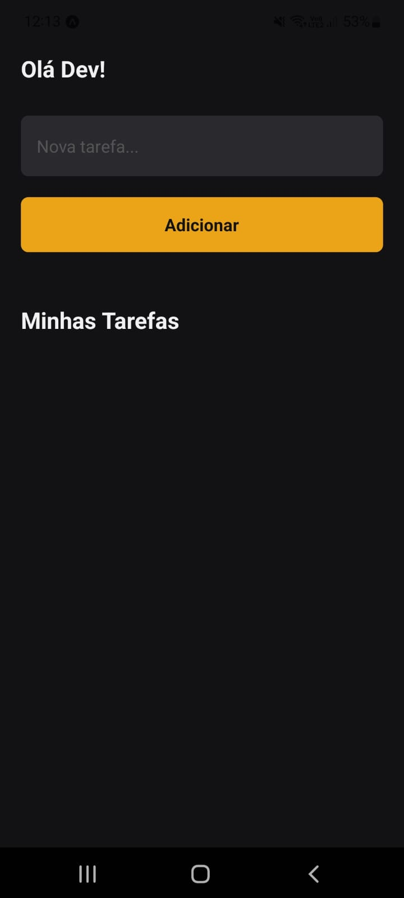
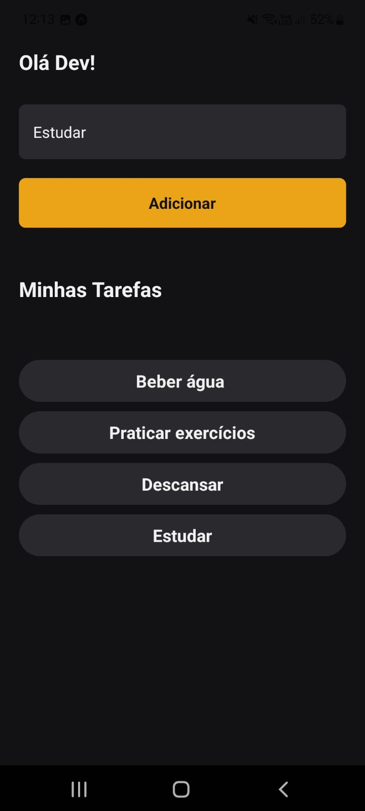
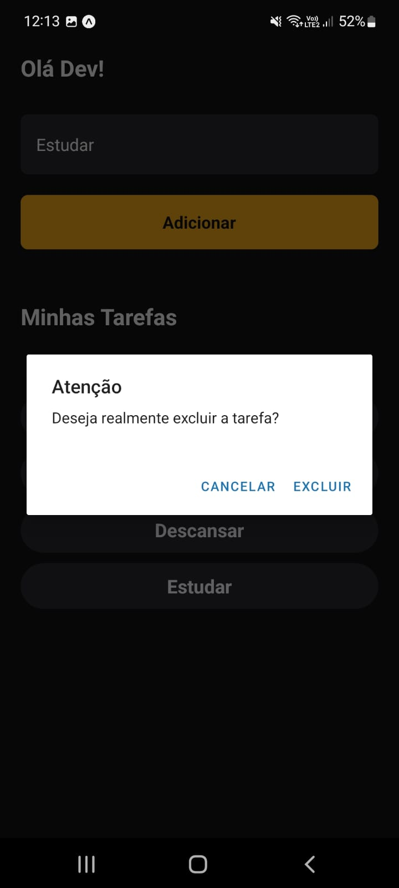

<h2 align="center">Aplicativo de Tarefas</h2> 

### 🔖 Sobre

---

O projeto **Aplicativo de Tarefas** é uma ferramenta que foi criada para gerar organização pessoal. Com este app, você pode **criar**, **editar** e **concluir** tarefas abertas.  

### 🚀 Tecnologias utilizadas

---

O projeto foi desenvolvido utilizando a seguinte tecnologia

-   [React-Native](https://reactnative.dev/)  

### 🖥️ Screens

---

Tela principal:
  
Tela adicionando tarefas:
  
Tela excluindo tarefa:
  

### 🔽 Possui

---

-   ✅ Criar e excluir tarefas.  

### 🤵 Autor

---

Desenvolvido com 💙 por Bruno Pereira.

